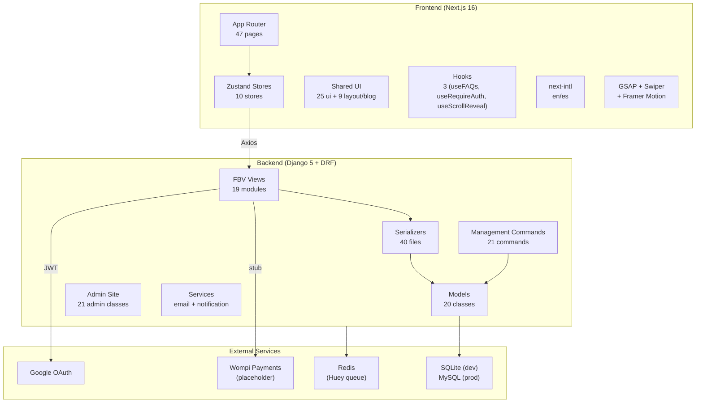
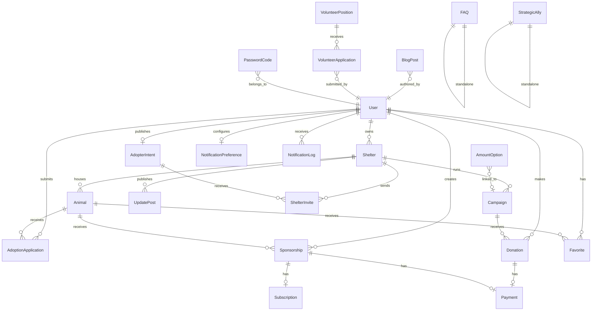
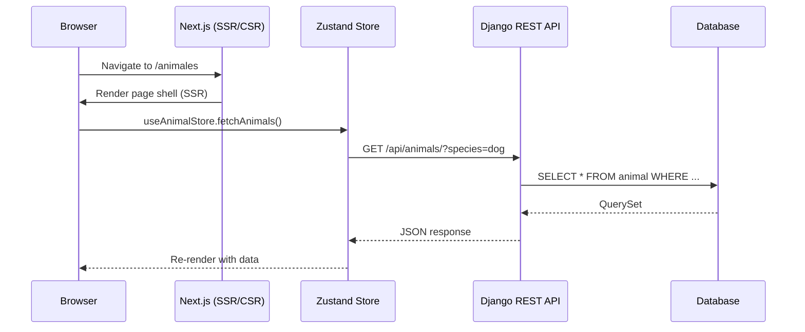

# Mi Huella — Architecture Overview

> Last updated: 2026-03-27

## System Diagram



## Data Model Relationships



## Models (21)

| # | Model | Key Fields |
|---|-------|------------|
| 1 | User | email, role, city, avatar, bio, housing_type, has_yard, has_other_pets, experience_level |
| 2 | Shelter | name, logo, cover_image, verification_status |
| 3 | Animal | species, age, gender, size, GalleryField |
| 4 | Adoption (AdoptionApplication) | form_answers (JSON), status |
| 5 | Campaign | goal_amount, raised_amount, progress_percentage, evidence_gallery |
| 6 | Donation | amount, shelter FK, campaign FK (both nullable) |
| 7 | Sponsorship | frequency (monthly/one_time), animal FK |
| 8 | Payment | amount, donation/sponsorship FK (both nullable) |
| 9 | UpdatePost | shelter, campaign, animal links |
| 10 | AdopterIntent | preferences (JSON), OneToOne User |
| 11 | ShelterInvite | unique_together shelter+intent |
| 12 | Subscription | OneToOne Sponsorship |
| 13 | Favorite | User + Animal through table |
| 14 | Notification | NotificationPreference + NotificationLog |
| 15 | PasswordCode | kept from template |
| 16 | BlogPost | bilingual, JSON content, SEO, categories |
| 17 | AmountOption | predefined donation/sponsorship amounts |
| 18 | FAQ | question/answer pairs |
| 19 | StrategicAlly | partner organizations |
| 20 | VolunteerPosition | volunteer opportunities |
| 21 | VolunteerApplication | position FK, user FK, motivation, status (pending/reviewed/accepted/rejected) |

## Request Flow



## Directory Structure

```
tuhuella_project/
├── backend/
│   ├── base_feature_app/
│   │   ├── models/          # 21 model files
│   │   ├── serializers/     # 41 serializer files
│   │   ├── views/           # 20 view modules
│   │   ├── urls/            # 19 URL modules
│   │   ├── management/commands/  # 21 commands
│   │   ├── services/        # email_service, notification_service, notification_templates
│   │   ├── utils/           # auth_utils, email_utils, recaptcha
│   │   ├── templates/emails/ # Branded HTML email templates (base + 3 specific)
│   │   ├── tests/           # 56 test files (models, serializers, views, services, utils, commands)
│   │   └── admin.py         # MiHuellaAdminSite (22 admin classes)
│   ├── base_feature_project/
│   │   ├── settings.py      # Base settings
│   │   ├── settings_prod.py # Production overrides
│   │   └── urls.py          # Root URL config
│   ├── django_attachments/  # Custom image handling
│   └── conftest.py          # Root pytest config
├── frontend/
│   ├── app/[locale]/        # 48 page.tsx files
│   │   ├── page.tsx         # Home
│   │   ├── template.tsx     # Framer Motion transitions
│   │   ├── layout.tsx       # Root layout (Inter, Header, Footer)
│   │   └── providers.tsx    # Google OAuth + Theme provider
│   ├── components/
│   │   ├── layout/          # Header, Footer, Sidebar, PageTransition, LocaleSwitcher, ThemeToggle
│   │   ├── blog/            # BlogContentRenderer, ReadingProgressBar
│   │   ├── ui/              # 26 shared components
│   │   └── providers/       # ThemeProvider
│   ├── lib/
│   │   ├── stores/          # 10 Zustand stores
│   │   ├── hooks/           # useFAQs, useRequireAuth, useScrollReveal
│   │   ├── services/        # http.ts, tokens.ts
│   │   ├── i18n/            # config.ts
│   │   ├── types.ts         # 34 exported types
│   │   └── constants.ts     # ROUTES, API_ENDPOINTS
│   ├── i18n/                # next-intl request config
│   ├── messages/            # en.json, es.json
│   └── e2e/                 # 14 Playwright spec files + flow-definitions.json (75 flows)
├── docs/
│   ├── methodology/         # PRD, technical, architecture, errors, lessons
│   └── *.md                 # Standards & guidelines (9 files)
├── scripts/                 # CI, quality gate, systemd
└── tasks/                   # Active context & task plan
```

## Security Architecture

| Layer | Mechanism |
|-------|-----------|
| Authentication | JWT (access + refresh) via `djangorestframework-simplejwt` |
| OAuth | Google sign-in with server-side token verification |
| Authorization | Role-based (`adopter`, `shelter_admin`, `admin`) + object-level queryset filtering |
| CSRF | Django middleware (session endpoints) |
| Input Validation | DRF serializers (server) + Zod-ready (client) |
| Secrets | `.env` files, never committed |
| Headers | HSTS, X-Frame-Options, Content-Type-Nosniff (prod) |

## Testing Architecture

| Layer | Count | Tool |
|-------|-------|------|
| Backend tests | 56 files | pytest + pytest-django |
| Frontend unit tests | 100 files | Jest + Testing Library |
| E2E tests | 14 spec files | Playwright |
| E2E flow definitions | 75 flows | flow-definitions.json |
