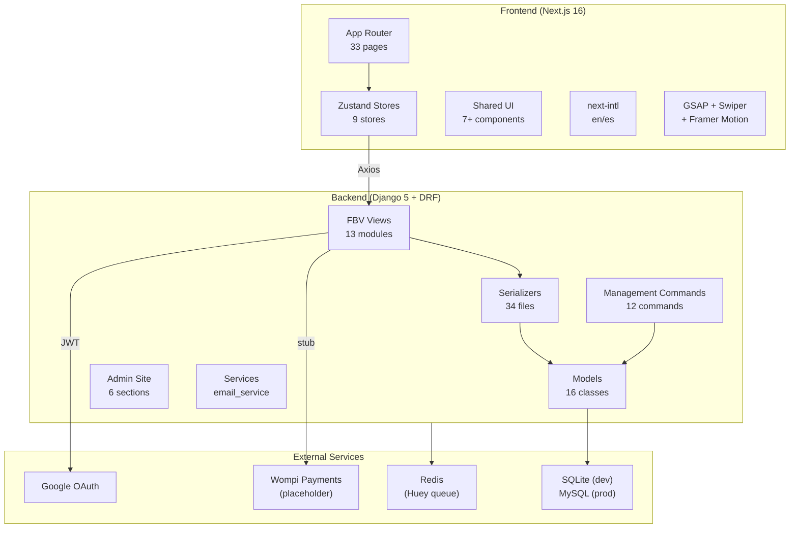
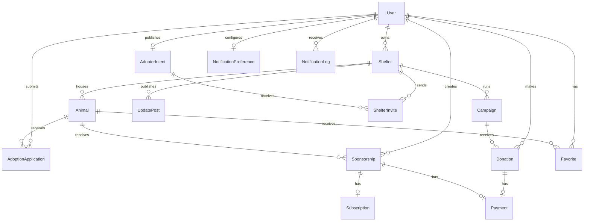
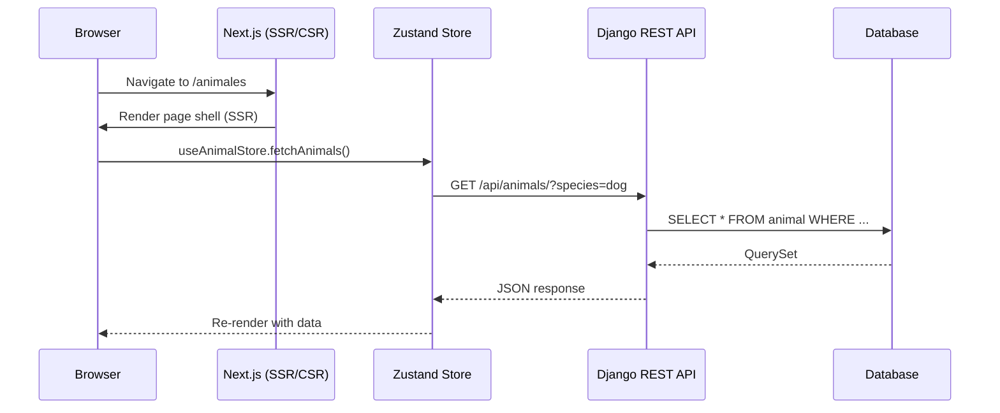

# Mi Huella — Architecture Overview

## System Diagram



## Data Model Relationships



## Request Flow



## Directory Structure

```
tuhuella_project/
├── backend/
│   ├── base_feature_app/
│   │   ├── models/          # 16 model files
│   │   ├── serializers/     # 34 serializer files
│   │   ├── views/           # 13 view modules
│   │   ├── urls/            # 13 URL modules
│   │   ├── management/commands/  # 12 commands
│   │   ├── services/        # email_service
│   │   ├── tests/           # pytest tests
│   │   └── admin.py         # MiHuellaAdminSite
│   ├── base_feature_project/
│   │   ├── settings.py      # Base settings
│   │   ├── settings_prod.py # Production overrides
│   │   └── urls.py          # Root URL config
│   └── conftest.py          # Root pytest config
├── frontend/
│   ├── app/                 # 33 page.tsx files
│   │   ├── page.tsx         # Home
│   │   ├── template.tsx     # Framer Motion transitions
│   │   ├── layout.tsx       # Root layout (Inter, Header, Footer)
│   │   └── providers.tsx    # Google OAuth provider
│   ├── components/
│   │   ├── layout/          # Header, Footer, PageTransition, LocaleSwitcher
│   │   └── ui/              # AnimalCard, ShelterCard, CampaignCard, etc.
│   ├── lib/
│   │   ├── stores/          # 9 Zustand stores
│   │   ├── hooks/           # useRequireAuth, useScrollReveal
│   │   ├── services/        # http.ts, tokens.ts
│   │   ├── i18n/            # config.ts
│   │   ├── types.ts         # 14 domain types
│   │   └── constants.ts     # ROUTES, API_ENDPOINTS
│   ├── i18n/                # next-intl request config
│   ├── messages/            # en.json, es.json
│   └── e2e/                 # Playwright specs + flow-definitions.json
├── docs/
│   ├── methodology/         # PRD, technical, architecture
│   └── *.md                 # Standards & guidelines
├── scripts/                 # CI, quality gate, systemd
└── tasks/                   # Active context & task plan
```

## Security Architecture

| Layer | Mechanism |
|-------|-----------|
| Authentication | JWT (access + refresh) via `djangorestframework-simplejwt` |
| OAuth | Google sign-in with server-side token verification |
| Authorization | Role-based (`adopter`, `shelter_admin`, `admin`) + object-level queryset filtering |
| CSRF | Django middleware (session endpoints) |
| Input Validation | DRF serializers (server) + Zod-ready (client) |
| Secrets | `.env` files, never committed |
| Headers | HSTS, X-Frame-Options, Content-Type-Nosniff (prod) |
