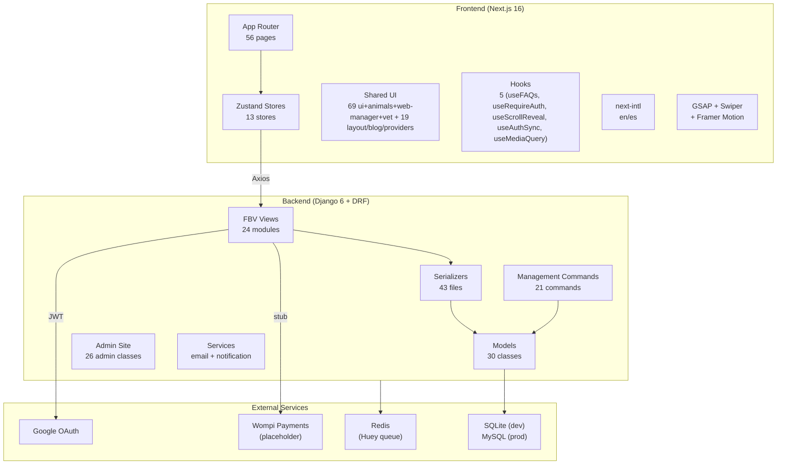
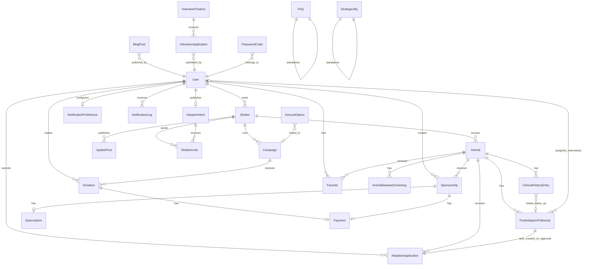
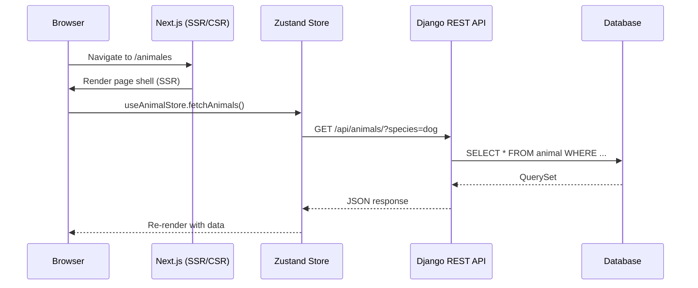

# Tuhuella — Architecture Overview

> Last updated: 2026-04-19

## System Diagram


```mermaid
graph TB
    subgraph Frontend["Frontend (Next.js 16)"]
        AppRouter["App Router<br/>56 pages"]
        Stores["Zustand Stores<br/>13 stores"]
        Components["Shared UI<br/>69 ui+animals+web-manager+vet + 19 layout/blog/providers"]
        Hooks["Hooks<br/>5 (useFAQs, useRequireAuth, useScrollReveal, useAuthSync, useMediaQuery)"]
        I18n["next-intl<br/>en/es"]
        GSAP["GSAP + Swiper<br/>+ Framer Motion"]
    end

    subgraph Backend["Backend (Django 6 + DRF)"]
        Views["FBV Views<br/>24 modules"]
        Serializers["Serializers<br/>43 files"]
        Models["Models<br/>30 classes"]
        Admin["Admin Site<br/>26 admin classes"]
        Commands["Management Commands<br/>21 commands"]
        Services["Services<br/>email + notification"]
    end

    subgraph External["External Services"]
        Google["Google OAuth"]
        Wompi["Wompi Payments<br/>(placeholder)"]
        Redis["Redis<br/>(Huey queue)"]
        DB["SQLite (dev)<br/>MySQL (prod)"]
    end

    AppRouter --> Stores
    Stores -->|Axios| Views
    Views --> Serializers
    Serializers --> Models
    Models --> DB
    Views -->|JWT| Google
    Views -->|stub| Wompi
    Commands --> Models
    Backend --> Redis
```

## Data Model Relationships


```mermaid
erDiagram
    User ||--o{ Shelter : owns
    User ||--o{ AdoptionApplication : submits
    User ||--o{ Donation : makes
    User ||--o{ Sponsorship : creates
    User ||--o{ Favorite : has
    User ||--o| AdopterIntent : publishes

    Shelter ||--o{ Animal : houses
    Shelter ||--o{ Campaign : runs
    Shelter ||--o{ UpdatePost : publishes
    Shelter ||--o{ ShelterInvite : sends

    Animal ||--o{ AdoptionApplication : receives
    Animal ||--o{ Sponsorship : receives
    Animal ||--o{ Favorite : receives
    Animal ||--o{ AnimalDiseaseScreening : has
    Animal ||--o{ ClinicalHistoryEntry : has
    Animal ||--o{ PostAdoptionFollowUp : has

    Campaign ||--o{ Donation : receives

    Sponsorship ||--o| Subscription : has
    Donation ||--o| Payment : has
    Sponsorship ||--o| Payment : has

    AdopterIntent ||--o{ ShelterInvite : receives

    User ||--o| NotificationPreference : configures
    User ||--o{ NotificationLog : receives

    BlogPost }o--|| User : authored_by
    AmountOption }o--o| Campaign : linked_to
    FAQ ||--|| FAQ : standalone
    StrategicAlly ||--|| StrategicAlly : standalone
    VolunteerPosition ||--o{ VolunteerApplication : receives
    VolunteerApplication }o--|| User : submitted_by
    PasswordCode }o--|| User : belongs_to
    PostAdoptionFollowUp ||--|| AdoptionApplication : auto_created_on_approval
    PostAdoptionFollowUp }o--o| User : assigned_veterinarian
    ClinicalHistoryEntry }o--o| PostAdoptionFollowUp : linked_follow_up
```

## Models (30 classes across 27 files)

| # | Model | Key Fields |
|---|-------|------------|
| 1 | User | email, role (adopter/shelter_admin/admin/veterinarian/web_manager), city, avatar, bio, housing_type, has_yard, has_other_pets, experience_level |
| 2 | Shelter | name, logo, cover_image, gallery, verification_status |
| 3 | Animal | species, age, gender, size, GalleryField, is_dewormed, vaccinated_at, sterilized_at, last_vet_checkup, medical_notes_es/en |
| 4 | Adoption (AdoptionApplication) | form_answers (JSON — includes has_pets + pets.cats/dogs/others since Fase 1), status |
| 5 | Campaign | goal_amount, raised_amount, progress_percentage, evidence_gallery |
| 6 | Donation | amount, shelter FK, campaign FK (both nullable) |
| 7 | Sponsorship | frequency (monthly/one_time), animal FK |
| 8 | Payment | amount, donation/sponsorship FK (both nullable) |
| 9 | UpdatePost | shelter, campaign, animal links |
| 10 | AdopterIntent | preferences (JSON), OneToOne User |
| 11 | ShelterInvite | unique_together shelter+intent |
| 12 | Subscription | OneToOne Sponsorship |
| 13 | Favorite | User + Animal through table, note |
| 14 | NotificationPreference | user FK, event_key, channel, unique_together |
| 15 | NotificationLog | user FK, event_key, channel, metadata (JSON), is_read |
| 16 | PasswordCode | kept from template |
| 17 | BlogPost | bilingual, JSON content, SEO, categories |
| 18 | DonationAmountOption | amount, label, is_active, order |
| 19 | SponsorshipAmountOption | amount, label, is_active, order |
| 20 | FAQTopic | slug, display_name_es/en, order |
| 21 | FAQItem | topic FK, question_es/en, answer_es/en |
| 22 | StrategicAlly | partner organizations |
| 23 | VolunteerPosition | volunteer opportunities, 12 categories |
| 24 | VolunteerApplication | position FK, user FK, motivation, status (pending/reviewed/accepted/rejected) |
| 25 | AnimalStatusHistory | animal FK, old/new status, changed_by, timestamp |
| 26 | PaymentHistory | payment FK, action, metadata (JSON) |
| 27 | ShelterMembership | shelter FK, user FK, role, joined_at |
| 28 | AnimalDiseaseScreening | animal FK, disease_key, result (positive/negative/not_tested), tested_on, notes; unique_together (animal, disease_key) |
| 29 | PostAdoptionFollowUp (ArchivableModel) | OneToOneField AdoptionApplication, animal FK, adopter FK, assigned_veterinarian FK (role=vet), status (pending/in_progress/completed/overdue), scheduled_date (+30d from approval) |
| 30 | ClinicalHistoryEntry | animal FK, follow_up FK (nullable), author FK, entry_type (checkup/vaccination/treatment/observation/incident), title, body_es/en, occurred_at, attachment_urls (JSON) |

## Request Flow


```mermaid
sequenceDiagram
    participant Browser
    participant NextJS as Next.js (SSR/CSR)
    participant Zustand as Zustand Store
    participant DRF as Django REST API
    participant DB as Database

    Browser->>NextJS: Navigate to /animales
    NextJS->>Browser: Render page shell (SSR)
    Browser->>Zustand: useAnimalStore.fetchAnimals()
    Zustand->>DRF: GET /api/animals/?species=dog
    DRF->>DB: SELECT * FROM animal WHERE ...
    DB-->>DRF: QuerySet
    DRF-->>Zustand: JSON response
    Zustand-->>Browser: Re-render with data
```

## Directory Structure

```
tuhuella_project/
├── backend/
│   ├── base_feature_app/
│   │   ├── models/          # 27 model files (30 classes)
│   │   ├── serializers/     # 43 serializer files
│   │   ├── views/           # 24 view modules (incl. web_manager_views, follow_up)
│   │   ├── urls/            # 23 URL modules (incl. follow_up)
│   │   ├── management/commands/  # 21 commands
│   │   ├── services/        # email_service, notification_service, notification_templates
│   │   ├── utils/           # auth_utils, email_utils, recaptcha, shelter_access (is_veterinarian, is_web_manager)
│   │   ├── templates/emails/ # Branded HTML email templates (base + 3 specific)
│   │   ├── tests/           # 99+ test files (models, serializers, views, services, utils, commands)
│   │   └── admin.py         # MiHuellaAdminSite (26 admin classes)
│   ├── base_feature_project/
│   │   ├── settings.py      # Base settings
│   │   ├── settings_prod.py # Production overrides
│   │   └── urls.py          # Root URL config
│   ├── django_attachments/  # Custom image handling
│   └── conftest.py          # Root pytest config
├── frontend/
│   ├── app/[locale]/        # 56 page.tsx files
│   │   ├── page.tsx         # Home
│   │   ├── template.tsx     # Framer Motion transitions
│   │   ├── layout.tsx       # Root layout (Inter, Header, Footer)
│   │   ├── providers.tsx    # Google OAuth + Theme provider
│   │   ├── web-manager/     # 4 pages (layout, applications, shelters list, shelter detail)
│   │   └── veterinarian/    # 3 pages (layout, follow-ups list, follow-up detail)
│   ├── components/
│   │   ├── layout/          # Header, Footer, Sidebar, PageTransition, LocaleSwitcher, ThemeToggle (6)
│   │   ├── blog/            # BlogContentRenderer, ReadingProgressBar (2)
│   │   ├── ui/              # 65 shared components
│   │   ├── animals/         # AnimalHealthSection (disease screenings, health pills, vet notes)
│   │   ├── web-manager/     # AdminApplicationsTable
│   │   ├── veterinarian/    # ClinicalEntryForm, ClinicalHistoryTimeline
│   │   └── providers/       # ThemeProvider, AuthSyncProvider (2)
│   ├── lib/
│   │   ├── stores/          # 13 Zustand stores (incl. webManagerStore, followUpStore, clinicalHistoryStore)
│   │   ├── hooks/           # useFAQs, useRequireAuth, useScrollReveal, useAuthSync, useMediaQuery
│   │   ├── services/        # http.ts, tokens.ts
│   │   ├── i18n/            # config.ts
│   │   ├── types.ts         # ~52 exported types (incl. DiseaseScreening, PostAdoptionFollowUp, ClinicalHistoryEntry)
│   │   └── constants.ts     # ROUTES, API_ENDPOINTS
│   ├── i18n/                # next-intl request config
│   ├── messages/            # en.json, es.json
│   └── e2e/                 # 17 Playwright spec files + flow-definitions.json (82 flows)
├── docs/
│   ├── methodology/         # PRD, technical, architecture, errors, lessons
│   └── *.md                 # Standards & guidelines (9 files)
├── scripts/                 # CI, quality gate, systemd
└── tasks/                   # Active context & task plan
```

## Security Architecture

| Layer | Mechanism |
|-------|-----------|
| Authentication | JWT (access + refresh) via `djangorestframework-simplejwt` |
| OAuth | Google sign-in with server-side token verification |
| Authorization | Role-based (`adopter`, `shelter_admin`, `admin`, `veterinarian`, `web_manager`) + object-level queryset filtering; helpers in `utils/shelter_access.py` |
| CSRF | Django middleware (session endpoints) |
| Input Validation | DRF serializers (server) + Zod-ready (client) |
| Secrets | `.env` files, never committed |
| Headers | HSTS, X-Frame-Options, Content-Type-Nosniff (prod) |

## Testing Architecture

| Layer | Count | Tool |
|-------|-------|------|
| Backend tests | 99+ files | pytest + pytest-django |
| Frontend unit tests | 289+ files | Jest + Testing Library |
| E2E tests | 17 spec files | Playwright |
| E2E flow definitions | 82 flows | flow-definitions.json |
